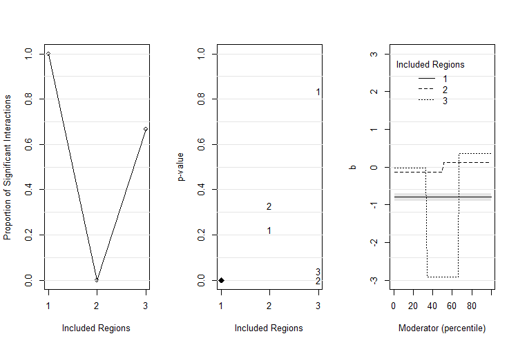
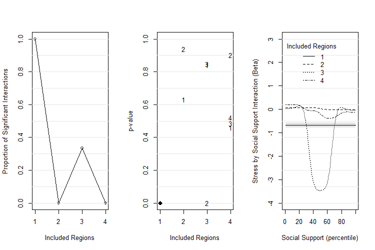

# Installation

## 1. Install and import devtools
Install devtools in R: `install.packages('devtools')`

Use `library(devtools)` to import devtools function and subfunctions.

## 2. Install and import plotHarmonics
Install plotHarmonics in R: `devtools::install_github('saccosj/plotHarmonics')`

If successful, the console should read:

`*DONE (plotHarmonics)`

Use `library(plotHarmonics)` to import plotHarmonics function and subfunctions.

If successful, the console should read:

```r
Attaching package: ?plotHarmonics?

The following objects are masked by ?.GlobalEnv?:

bootCA, findHarmonics, getData, searchInt, searchLoop
```
If there are any errors or comments, please contact the main author at: shane.sacco@uconn.edu

# Using plotHarmonics

## 1. Syntax
`plotHarmonics (X = predictor, Y = outcome, M = moderator, data = dataset)`

## 2. Examples

### R Code
```r
#Generate simulation data and discontinous interaction model

Predictor <- rnorm(1500, 0, 0.5)

Moderator <- rnorm(1500, 0, 0.5)

Outcome <- rep(0, 1500)

Error <- rnorm(1500, 0, 0.5)

Outcome [Moderator <= 0] = 0.5 * Predictor [Moderator <= 0] + Error [Moderator <= 0]

Outcome [Moderator > 0] = -0.5 * Predictor [Moderator > 0] + Error [Moderator > 0]

#Send variables to dataframe

ExampleDat <- data.frame(Predictor, Moderator, Outcome)

#Run plotHarmonics

plotHarmonics (X = ExampleDat$Predictor, 
          Y = ExampleDat$Outcome, 
          M = ExampleDat$Moderator, 
          data=ExampleDat, 
          minmax = c(-3,3))
```

#### Output


### Specifying Extra Parameters
Using the same R code in Example 1, some parameters of plotHarmonics were changed to exemplify customization options.

```r
  plotHarmonics (X = ExampleDat$Predictor, 
            Y = ExampleDat$Outcome, 
            M = ExampleDat$Moderator, 
            data=ExampleDat, 
            minmax = c(-4,3), 
            smooth = TRUE, 
            nbin = 4, 
            labels = c("Social Support (percentile)", "Stress by Social Support (Interaction Beta)"), 
            alpha = .10)      
```

#### Output


